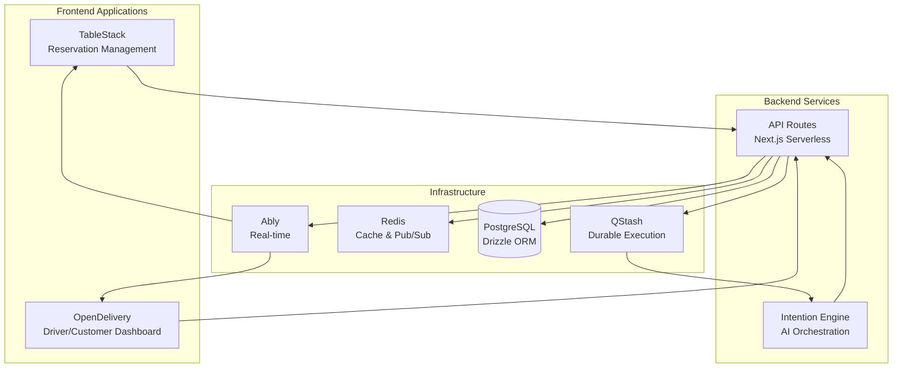
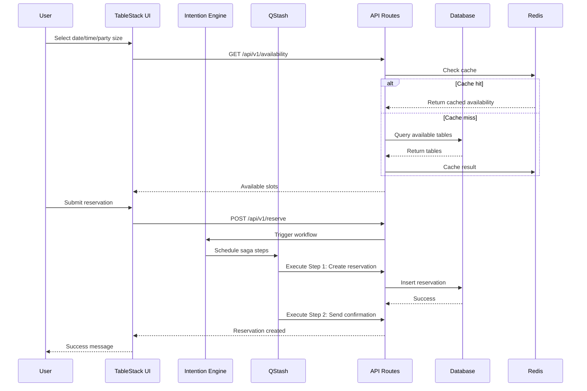
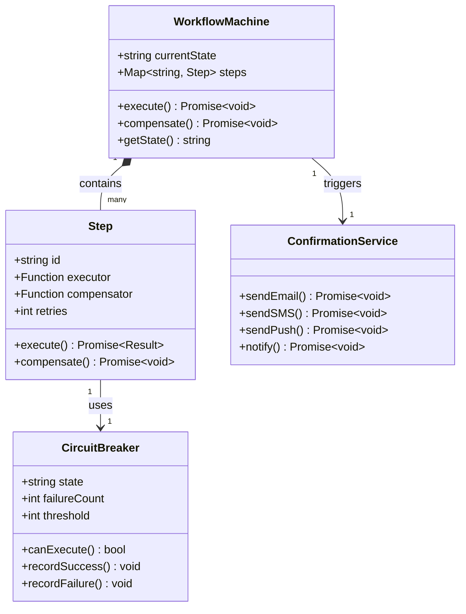

# Platform Monorepo

[](https://github.com/platform-monorepo/actions/workflows/ci-tests.yml)
[](./coverage/)
[](./LICENSE)

A sophisticated monorepo containing a restaurant reservation platform (TableStack), autonomous delivery network (OpenDelivery), and AI-powered intention engine. Built with Next.js 15, React 19, TypeScript, Drizzle ORM, and real-time capabilities via Ably.

## 🏗️ System Architecture

### High-Level Overview



### Reservation Flow Sequence



### Workflow Machine & Confirmation Service



## 📦 Applications

| Application          | Description                                    | Port | Stack                   |
| -------------------- | ---------------------------------------------- | ---- | ----------------------- |
| **TableStack**       | Restaurant reservation & floor plan management | 3000 | Next.js, React, Drizzle |
| **OpenDelivery**     | Autonomous delivery with Web3 payments         | 3001 | Next.js, wagmi, viem    |
| **Intention Engine** | AI agent orchestration                         | 3002 | Next.js, OpenAI         |

## 📦 Shared Packages

| Package              | Purpose                                            |
| -------------------- | -------------------------------------------------- |
| `@repo/shared`       | Core utilities: errors, logging, tracing, security |
| `@repo/database`     | Drizzle ORM schema & migrations                    |
| `@repo/auth`         | Clerk authentication utilities                     |
| `@repo/ui-theme`     | Shared UI components (shadcn/ui-style)             |
| `@repo/mcp-protocol` | Model Context Protocol definitions                 |

## 🚀 Getting Started

### Prerequisites

- **Node.js 24.x** (required)
- **pnpm 8.x**
- **PostgreSQL 16+**
- **Redis 7+**

### Installation

```bash
# Clone repository
git clone <repo-url>
cd platform-monorepo

# Install dependencies
pnpm install

# Set up environment
cp .env.local.example .env.local
# Edit .env.local with your configuration

# Generate database schema
pnpm db:generate

# Push schema to database
pnpm db:push

# Start all applications
pnpm dev
```

### Available Scripts

| Command                 | Description                        |
| ----------------------- | ---------------------------------- |
| `pnpm dev`              | Start all apps in development mode |
| `pnpm build`            | Build all applications             |
| `pnpm start`            | Start production servers           |
| `pnpm test`             | Run unit tests                     |
| `pnpm test:coverage`    | Run tests with coverage            |
| `pnpm test:integration` | Run integration tests              |
| `pnpm test:e2e`         | Run E2E tests with Playwright      |
| `pnpm lint`             | Run linter                         |
| `pnpm db:generate`      | Generate Drizzle migrations        |
| `pnpm db:push`          | Push schema to database            |

## 🧪 Testing

### Test Structure

```
e2e/                           # Playwright E2E tests
├── reservation-flow.spec.ts   # Critical user journeys

apps/table-stack/src/__tests__/
├── integration/
│   ├── reservation-flow.test.ts
│   └── reservation-flow-msw.test.ts  # MSW-based tests
```

### Running Tests

```bash
# Unit tests
pnpm test

# Integration tests (with MSW mocks)
pnpm test:integration

# E2E tests (Playwright)
pnpm test:e2e

# Tests with coverage
pnpm test:coverage
```

### Test Coverage Thresholds

- **Branches**: 90%
- **Functions**: 90%
- **Lines**: 90%
- **Statements**: 90%

## 📚 API Documentation

Interactive API documentation is available at:

- **TableStack**: `http://localhost:3000/api/docs` (Swagger UI)
- **OpenAPI Spec**: `http://localhost:3000/api/docs/openapi.json`

## 🏛️ Architecture Decisions

Key architectural decisions are documented in ADRs (Architecture Decision Records):

- **ADR-001**: Saga Pattern for Distributed Transactions
- **ADR-002**: Zero-Trust Authentication (RS256)
- **ADR-003**: Optimistic Concurrency Control
- **ADR-004**: Ably for Real-time Updates

## 🔐 Security

- Zero-Trust authentication with RS256 JWT
- Prompt injection detection for AI endpoints
- Replay guards for Web3 transactions
- Circuit breakers for external service calls
- Rate limiting on all public endpoints

## 📊 Observability

- OpenTelemetry integration
- Structured logging (pino)
- Custom State Diff Viewer for debugging
- Health check endpoints (`/api/health`)
- Readiness probes (`/api/ready`)

## 🚧 CI/CD

GitHub Actions runs on every PR:

1. Schema Validation
2. Lint & Type Check
3. Unit Tests (with coverage)
4. Integration Tests
5. Chaos Tests
6. E2E Tests (Playwright)
7. Build Verification

## 📝 Roadmap to A+

### Phase 1: Stabilization & DX ✅

- [x] Centralized QueryClient configuration
- [x] Standardized error handling hook
- [x] TanStack Query integration
- [x] SWR → TanStack Query migration

### Phase 2: Testing & Reliability ✅

- [x] Playwright E2E test setup
- [x] MSW for API-level mocking
- [x] GitHub Actions E2E integration
- [x] Critical path reservation flow test

### Phase 3: Documentation & Onboarding ✅

- [x] Swagger UI for API docs
- [x] Mermaid architecture diagrams
- [x] Comprehensive README

### Phase 4: Performance Optimization

- [ ] ISR caching for availability endpoint
- [ ] Bundle size optimization
- [ ] Edge caching for public data
- [ ] Dynamic imports for heavy dependencies

## 🤝 Contributing

1. Create a feature branch
2. Write tests for new functionality
3. Ensure all tests pass: `pnpm test`
4. Submit a PR with clear description

## 📄 License

MIT - See [LICENSE](./LICENSE) for details.
