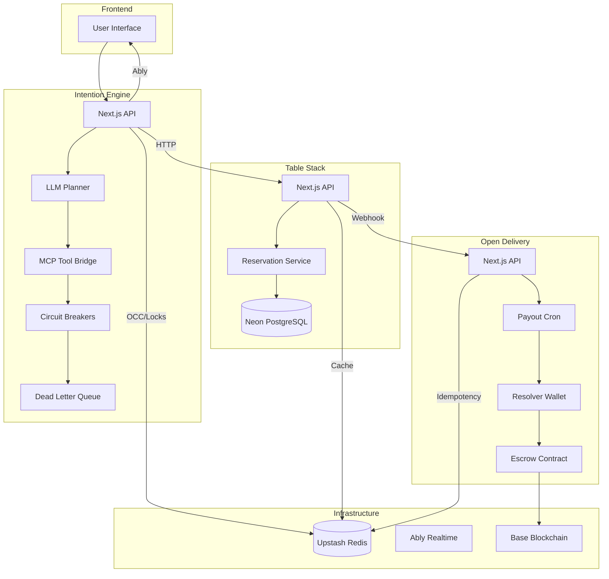

# Platform Architecture

## Overview

A modular, multi-application platform for autonomous food delivery and restaurant management. The system comprises three core applications interconnected via MCP (Model Context Protocol), Ably realtime pub/sub, and Redis-backed task queues, with Web3-based non-custodial escrow for driver payouts.

## System Diagram



## Applications

### Intention Engine

| Attribute   | Value                                                       |
| ----------- | ----------------------------------------------------------- |
| **Path**    | `apps/intention-engine/`                                    |
| **Runtime** | Next.js (Vercel Serverless)                                 |
| **Purpose** | AI-driven user intent parsing and autonomous tool execution |

**Key Features:**

- LLM planning pipeline: classification → planning → execution → summarization
- MCP (Model Context Protocol) bridge for external tool integration
- Semantic memory with pgvector fallback
- Circuit breakers per tool with automatic failure detection
- Dead Letter Queue (DLQ) for failed task recovery
- Optimistic Concurrency Control (OCC) via Redis Lua scripts
- Redlock distributed locks for saga orchestration
- Structured LLM observability with prompt versioning and fallback routing

### Table Stack

| Attribute   | Value                                       |
| ----------- | ------------------------------------------- |
| **Path**    | `apps/table-stack/`                         |
| **Runtime** | Next.js (Vercel Serverless)                 |
| **Purpose** | Restaurant reservation and order management |

**Key Features:**

- EIP-712 typed data signing for reservation verification
- Idempotent reservation creation via Redis-backed idempotency keys
- Shadow restaurant discovery for unmatched restaurant names
- Drizzle ORM + Neon PostgreSQL for data persistence
- Outbox pattern for reliable event publishing
- Serverless timeout + retry middleware for transient failure resilience

### Open Delivery

| Attribute   | Value                                                    |
| ----------- | -------------------------------------------------------- |
| **Path**    | `apps/open-delivery/`                                    |
| **Runtime** | Next.js (Vercel Serverless)                              |
| **Purpose** | Decentralized delivery with non-custodial escrow payouts |

**Key Features:**

- Non-custodial escrow model (users retain funds until delivery)
- Cron-based automated tip release to drivers
- Resolver wallet with Redis-backed nonce tracking and dynamic gas estimation
- Ably realtime notifications for order status updates
- HMAC-signed webhooks for external system integration
- Serverless timeout + retry middleware for transient failure resilience

## Data Flow

### User Intent → Autonomous Execution

```
1. User submits natural language request
   ↓
2. Intention Engine parses intent via LLM classification
   ↓
3. LLM Planner creates execution plan (DAG of tool calls)
   ↓
4. Tool execution via MCP bridge with circuit breaker protection
   ↓
5. Results collected, OCC ensures state consistency
   ↓
6. LLM Summarization generates user-facing response
   ↓
7. Response pushed to UI via Ably realtime pub/sub
   ↓
8. Webhook delivery for external system notifications
```

### Reservation Flow

```
1. User requests reservation via Table Stack API
   ↓
2. Idempotency key validated against Redis
   ↓
3. Shadow restaurant lookup if no direct match
   ↓
4. Reservation created in PostgreSQL
   ↓
5. EIP-712 signature generated for verification
   ↓
6. Confirmation email sent via Resend
   ↓
7. Real-time update pushed via Ably
```

### Payout Flow

```
1. Cron job triggers on schedule (or manual trigger)
   ↓
2. Resolver wallet balance checked (minimum threshold)
   ↓
3. Orders with escrowStatus='locked' and status='delivered' queried
   ↓
4. For each batch (5 orders):
   a. Status updated to 'releasing' (idempotent)
   b. Nonce fetched from Redis nonce tracker
   c. Gas price fetched from blockchain with 10% buffer
   d. escrow.releaseTip() called via viem writeContract
   e. Transaction receipt verified
   f. Order status updated to 'released' or 'failed'
   ↓
5. Drivers notified via Ably
```

## Resilience Architecture

### Layer 1: Circuit Breaker

```
States: Closed → Open → Half-Open → Closed

Per-tool circuit breakers with configurable thresholds:
- Failure threshold: trips after N consecutive failures
- Recovery timeout: attempts half-open after T seconds
- Success threshold: closes after M successes in half-open

Implementation: packages/shared/src/services/circuit-breaker.ts
Redis keys: ie:circuit-breaker:{toolName}:{state|failures|lastFailure}
```

### Layer 2: Dead Letter Queue (DLQ)

```
Failed tasks moved to DLQ after max retries exhausted

DLQ Monitor polls for stuck sagas:
- Poll interval: configurable (default 30s)
- Max DLQ depth alert threshold
- Manual replay via admin endpoint

Implementation: packages/shared/src/services/dlq-monitoring.ts
Redis keys: ie:task:dlq:*
```

### Layer 3: Retry with Exponential Backoff

```
Transient failures: 3 retries with jitter
Formula: delay = Math.random() * baseDelay * 2^attempt
Retryable errors: ECONNRESET, ETIMEDOUT, 5xx responses

Implementation: packages/shared/src/middleware/retry-with-backoff.ts
```

### Layer 4: Serverless Timeout Middleware

```
Hard cutoff at 8s (Vercel Hobby limit: 10s, 2s buffer)
Uses AbortController + Promise.race
Auto-responds with 504 + structured error payload

Implementation: packages/shared/src/middleware/serverless-timeout.ts
```

### Layer 5: Optimistic Concurrency Control (OCC)

```
Redis Lua scripts for atomic CAS (Compare-And-Swap) operations
Prevents race conditions between concurrent state updates
Rebase mechanism for conflict resolution

Implementation: packages/shared/src/services/occ-rebase.ts
```

### Layer 6: Web3 Nonce Tracker

```
Redis-backed atomic nonce counter with Lua scripts
Prevents nonce collisions between concurrent cron runs
Dynamic gas estimation with 10% safety buffer
Exponential backoff retry on nonce/gas errors

Implementation: packages/shared/src/utils/nonce-tracker.ts
```

### Layer 7: Manual Fallback

- Admin endpoints for manual intervention
- Redis-based state recovery
- Direct database queries for investigation
- Circuit breaker reset commands

## Infrastructure

### Redis (Upstash)

| Attribute      | Value                                                                                           |
| -------------- | ----------------------------------------------------------------------------------------------- |
| **Provider**   | Upstash                                                                                         |
| **Namespaces** | IE, OD, TS, SHARED                                                                              |
| **Uses**       | OCC, task queues, caching, Redlock distributed locks, memory store, idempotency, nonce tracking |

**Key Patterns:**

- `ie:task:{taskId}:state` - Task state machine
- `ie:circuit-breaker:{toolName}:state` - Circuit breaker states
- `ie:llm:audit:recent` - LLM audit trail
- `shared:nonce:{chainId}:{address}` - Web3 nonce tracker
- `ts:idempotency:{key}` - Idempotency cache

### Database (Neon PostgreSQL)

| Attribute      | Value                           |
| -------------- | ------------------------------- |
| **Provider**   | Neon (Serverless Postgres)      |
| **ORM**        | Drizzle ORM                     |
| **Migrations** | drizzle-kit generate/check      |
| **Schema**     | `packages/database/src/schema/` |

### Realtime (Ably)

| Attribute    | Value                                        |
| ------------ | -------------------------------------------- |
| **Provider** | Ably                                         |
| **Uses**     | UI updates, presence tracking, notifications |
| **Channels** | Namespace-based: `ie:`, `od:`, `ts:`         |

### Web3 (Base)

| Attribute    | Value                                                   |
| ------------ | ------------------------------------------------------- |
| **Network**  | Base (Chain ID: 8453)                                   |
| **Contract** | Non-custodial escrow                                    |
| **Library**  | viem                                                    |
| **Wallet**   | Resolver wallet (automated payouts)                     |
| **Features** | Nonce tracking, dynamic gas estimation, EIP-712 signing |

## Security

| Layer              | Mechanism                                           |
| ------------------ | --------------------------------------------------- |
| **Authentication** | Zero-Trust JWT validation                           |
| **API Security**   | Prompt injection detection, HMAC-signed webhooks    |
| **Web3**           | EIP-712 typed data signing, nonce tracking          |
| **Idempotency**    | Redis-backed idempotency keys                       |
| **Concurrency**    | OCC + Redlock distributed locks                     |
| **Serverless**     | Timeout middleware (8s cutoff for 10s Vercel limit) |

## CI/CD Pipeline

| Stage             | Description                                                   |
| ----------------- | ------------------------------------------------------------- |
| Schema Validation | `schema-sync-strict.yml` - MCP/DB schema consistency          |
| Drizzle Check     | `drizzle-kit check --diagnose` - migration drift detection    |
| Lint & Type Check | ESLint + TypeScript strict mode                               |
| Unit Tests        | Vitest with 90% coverage threshold                            |
| Integration Tests | MSW network-level mocks for external services                 |
| Chaos Tests       | k6-based fault injection (latency, Redis failure, DB failure) |
| Performance       | k6 load testing and performance budgets                       |
| E2E               | Playwright browser tests                                      |

## Further Reading

- [Production Runbooks](./RUNBOOKS.md) - Operational procedures for common failure modes
- [README](../README.md) - Quickstart and local development setup
