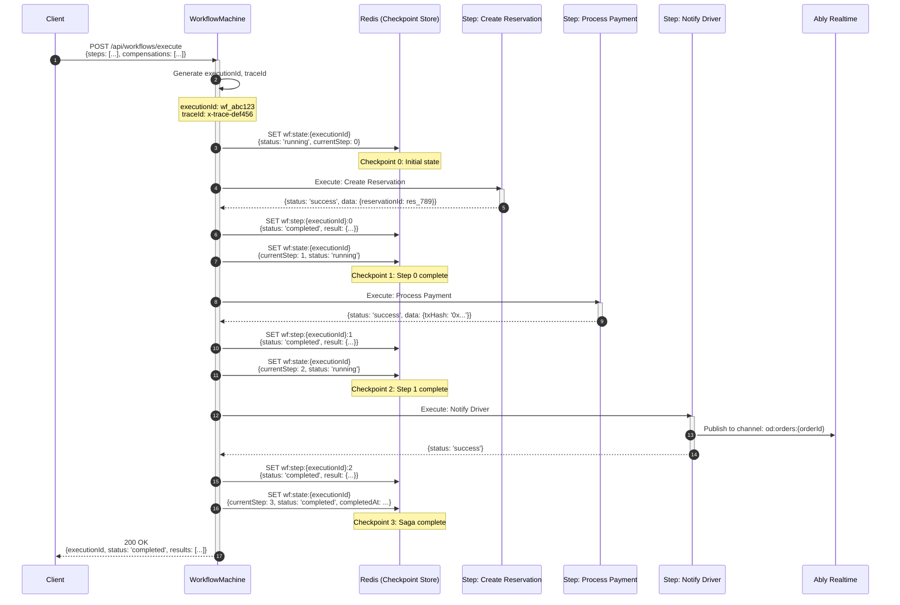
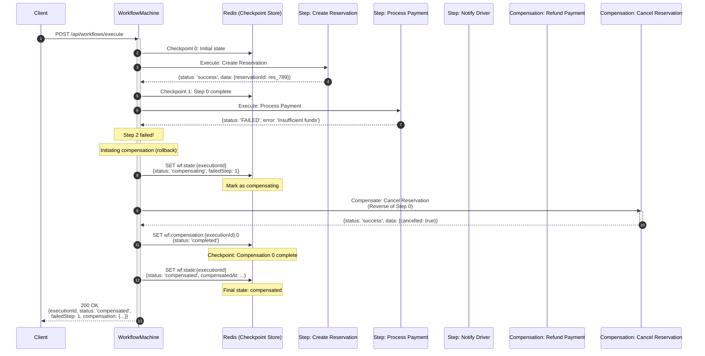
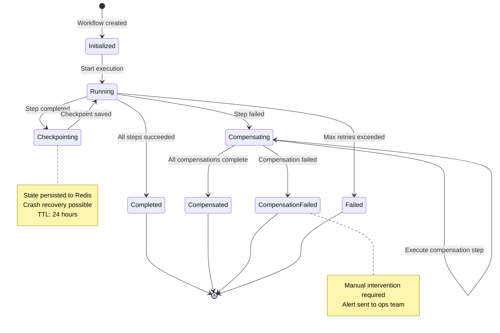
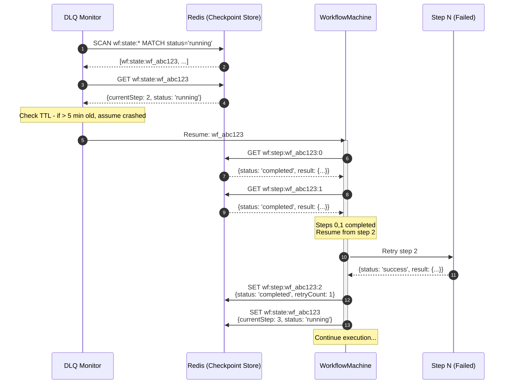

# Saga Orchestration & Checkpointing Flow

## Overview

The `WorkflowMachine` implements the Saga pattern with checkpointing to manage distributed transactions across multiple services. Each step in the workflow is a transaction with a corresponding compensation step. State is persisted to Redis for crash recovery and replay.

## Sequence Diagram: Successful Saga



## Sequence Diagram: Saga with Compensation (Failure & Rollback)



## State Machine: WorkflowMachine



## Redis Persistence Schema

### Key Patterns

| Key Pattern                                 | TTL | Value Schema                                             | Purpose                  |
| ------------------------------------------- | --- | -------------------------------------------------------- | ------------------------ |
| `wf:state:{executionId}`                    | 24h | `{status, currentStep, steps, compensations, startedAt}` | Workflow state machine   |
| `wf:step:{executionId}:{stepIndex}`         | 24h | `{status, result, executedAt, retryCount}`               | Individual step result   |
| `wf:compensation:{executionId}:{compIndex}` | 24h | `{status, result, executedAt}`                           | Compensation step result |
| `wf:trace:{traceId}`                        | 7d  | `{executionId, startedAt, completedAt}`                  | Trace ID correlation     |

### Checkpoint Data Structure

```typescript
interface WorkflowCheckpoint {
  executionId: string;
  traceId: string;
  status: "running" | "completed" | "compensating" | "compensated" | "failed";
  currentStep: number;
  steps: StepResult[];
  compensations: CompensationResult[];
  startedAt: string;
  completedAt?: string;
  failedStep?: number;
  error?: string;
}

interface StepResult {
  index: number;
  name: string;
  status: "pending" | "running" | "completed" | "failed";
  result?: any;
  error?: string;
  executedAt?: string;
  retryCount: number;
}
```

## Crash Recovery Mechanism

When a workflow crashes mid-execution:



## Implementation Details

### Key Files

- **WorkflowMachine**: `packages/shared/src/services/workflow-machine.ts`
- **Checkpoint Store**: `packages/shared/src/services/checkpoint-store.ts`
- **DLQ Monitor**: `packages/shared/src/services/dlq-monitoring.ts`
- **Saga Orchestrator**: `packages/shared/src/services/saga-orchestrator.ts`

### Redis Lua Script for Atomic Checkpointing

```lua
-- packages/shared/src/redis/scripts/checkpoint.lua
-- Atomic checkpoint update with CAS (Compare-And-Swap)

local key = KEYS[1]
local expectedVersion = tonumber(ARGV[1])
newState = cjson.decode(ARGV[2])
local ttl = tonumber(ARGV[3])

local current = redis.call('GET', key)
if current then
    local currentData = cjson.decode(current)
    if currentData.version ~= expectedVersion then
        return {err = 'VERSION_CONFLICT', version = currentData.version}
    end

    newState.version = expectedVersion + 1
    redis.call('SET', key, cjson.encode(newState), 'EX', ttl)
    return {ok = true, version = newState.version}
else
    newState.version = 1
    redis.call('SET', key, cjson.encode(newState), 'EX', ttl)
    return {ok = true, version = 1}
end
```

### Retry with Exponential Backoff

```typescript
// From packages/shared/src/middleware/retry-with-backoff.ts
async function executeStepWithRetry(
  step: Step,
  maxRetries = 3,
): Promise<StepResult> {
  for (let attempt = 0; attempt <= maxRetries; attempt++) {
    try {
      const result = await step.execute();
      return { status: "completed", result, retryCount: attempt };
    } catch (error) {
      if (attempt === maxRetries) {
        throw error;
      }

      // Exponential backoff with jitter
      const delay = Math.random() * 100 * Math.pow(2, attempt);
      await sleep(delay);
    }
  }
}
```

## Monitoring & Observability

### Metrics

| Metric                 | Description                                | Alert Threshold |
| ---------------------- | ------------------------------------------ | --------------- |
| `saga_duration_ms`     | Total saga execution time                  | p95 > 30s       |
| `step_duration_ms`     | Individual step execution time             | p95 > 5s        |
| `compensation_rate`    | Percentage of sagas requiring compensation | > 5%            |
| `checkpoint_write_ms`  | Redis checkpoint write latency             | p95 > 100ms     |
| `crash_recovery_count` | Number of crashed workflows recovered      | Track trend     |

### Trace ID Propagation

Every workflow generates a unique `x-trace-id` that propagates through all steps:

```typescript
const traceId = `wf-${Date.now()}-${crypto.randomUUID()}`;

// Inject into all downstream API calls
const headers = {
  "x-trace-id": traceId,
  "x-execution-id": executionId,
  "x-step-index": stepIndex.toString(),
};
```

### Log Correlation

All log entries include trace metadata:

```json
{
  "level": "info",
  "message": "Step completed successfully",
  "traceId": "wf-1234567890-abc123",
  "executionId": "wf_abc123",
  "stepIndex": 2,
  "stepName": "ProcessPayment",
  "durationMs": 1234,
  "timestamp": "2026-04-08T10:30:00.000Z"
}
```

## Error Handling

| Error Type            | Scenario                               | Resolution                          |
| --------------------- | -------------------------------------- | ----------------------------------- |
| `STEP_FAILED`         | Step execution fails after max retries | Trigger compensation                |
| `CHECKPOINT_CONFLICT` | Concurrent checkpoint writes           | Retry with CAS rebase               |
| `COMPENSATION_FAILED` | Compensation step fails                | Alert ops, move to DLQ              |
| `CRASH_DETECTED`      | Workflow stuck in 'running' state      | DLQ monitor resumes from checkpoint |
| `TIMEOUT_EXCEEDED`    | Saga exceeds 30s limit                 | Abort and compensate                |

## Testing

```bash
# Run workflow machine unit tests
pnpm test -- workflow-machine

# Run saga integration tests
pnpm test:integration -- saga-orchestrator

# Run crash recovery tests
pnpm test:integration -- crash-recovery

# Run E2E saga flow test
pnpm test:e2e -- saga-flow
```
