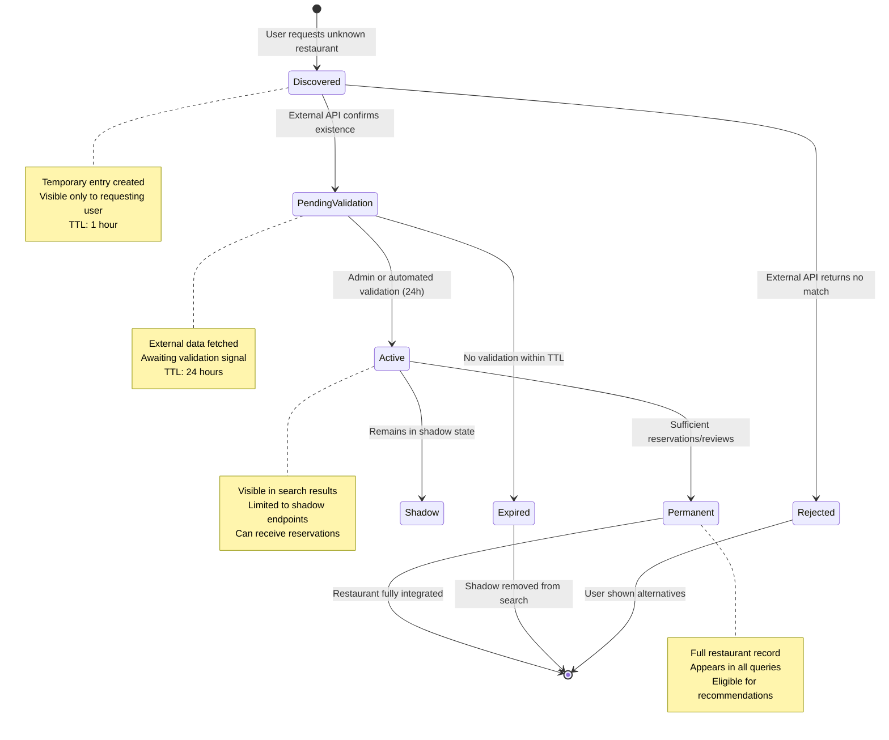

# Shadow Restaurant Discovery Flow

## Overview

When a user requests a reservation at a restaurant that doesn't exist in the database, the system employs a "Shadow Restaurant" discovery pattern. This flow creates a temporary restaurant entry, validates it through external APIs, and either promotes it to a permanent entry or gracefully degrades.

## Sequence Diagram

```mermaid
sequenceDiagram
    autonumber
    participant User
    participant TableStack as Table Stack API
    participant Redis as Redis Cache
    participant Postgres as PostgreSQL
    participant ExternalAPI as External Restaurant API
    participant IntentionEngine as Intention Engine

    User->>TableStack: POST /api/reservations<br/>{restaurantName: "NonExistent Place"}
    activate TableStack

    TableStack->>Postgres: SELECT * FROM restaurants<br/>WHERE name ILIKE 'NonExistent Place'
    activate Postgres
    Postgres-->>TableStack: [] (empty result)
    deactivate Postgres

    Note over TableStack: Restaurant not found<br/>Initiate Shadow Discovery

    TableStack->>Redis: GET shadow:pending:{userId}
    activate Redis
    Redis-->>TableStack: null (no pending shadow)
    deactivate Redis

    TableStack->>ExternalAPI: GET /restaurants/search?name=NonExistent+Place
    activate ExternalAPI

    alt External API Returns Match
        ExternalAPI-->>TableStack: {id: ext_123, name: "NonExistent Place", ...}
        deactivate ExternalAPI

        TableStack->>Postgres: INSERT INTO restaurants<br/>(name, external_id, status='shadow')<br/>RETURNING *
        activate Postgres
        Postgres-->>TableStack: {id: new_restaurant_id, ...}
        deactivate Postgres

        TableStack->>Redis: SET shadow:pending:{userId}<br/>{restaurantId: new_restaurant_id, ttl: 3600}
        activate Redis
        Redis-->>TableStack: OK
        deactivate Redis

        TableStack->>TableStack: Create reservation at shadow restaurant
        Note over TableStack: Reservation proceeds normally

    else External API Returns No Match
        ExternalAPI-->>TableStack: 404 Not Found
        deactivate ExternalAPI

        TableStack->>IntentionEngine: POST /api/intent<br/>{text: "User requested NonExistent Place"}
        activate IntentionEngine

        IntentionEngine->>IntentionEngine: LLM intent analysis
        Note over IntentionEngine: Attempt to infer user intent<br/>and suggest alternatives

        IntentionEngine-->>TableStack: {suggestions: [...], confidence: 0.75}
        deactivate IntentionEngine

        TableStack->>User: 400 Bad Request<br/>{error: "RESTAURANT_NOT_FOUND",<br/>suggestions: [...]}
        Note over TableStack: Graceful degradation with alternatives
    end

    TableStack-->>User: 201 Created<br/>{reservation, restaurant: {isShadow: true}}
    deactivate TableStack

    Note over User,Postgres: Shadow restaurant is now temporary visible<br/>for 24 hours pending validation

```

## State Machine: Shadow Restaurant Lifecycle



## Implementation Details

### Key Files

- **API Handler**: `apps/table-stack/src/app/api/reservations/route.ts`
- **Shadow Discovery Service**: `apps/table-stack/src/services/shadow-restaurant.ts`
- **External API Integration**: `packages/shared/src/services/restaurant-api.ts`
- **Redis Keys**: `shadow:pending:{userId}`, `shadow:restaurant:{id}`

### Redis Keys

| Pattern                     | TTL | Purpose                                 |
| --------------------------- | --- | --------------------------------------- |
| `shadow:pending:{userId}`   | 1h  | Track pending shadow discovery for user |
| `shadow:restaurant:{id}`    | 24h | Shadow restaurant metadata cache        |
| `shadow:validation:{extId}` | 24h | External API validation cache           |

### Database Schema

```sql
CREATE TABLE restaurants (
  id UUID PRIMARY KEY DEFAULT gen_random_uuid(),
  name TEXT NOT NULL,
  external_id TEXT,
  status TEXT NOT NULL DEFAULT 'active' CHECK (status IN ('active', 'shadow', 'pending_validation', 'rejected', 'permanent')),
  shadow_metadata JSONB, -- {discoveredAt, validatedAt, externalData}
  created_at TIMESTAMP DEFAULT NOW(),
  updated_at TIMESTAMP DEFAULT NOW()
);

-- Index for shadow restaurant queries
CREATE INDEX idx_restaurants_shadow ON restaurants(status, created_at)
  WHERE status = 'shadow';
```

### OCC Rebase Logic

When concurrent reservations hit the same shadow restaurant:

1. **First Request**: Creates shadow restaurant with `version: 1`
2. **Concurrent Request**: Reads `version: 1`, attempts update
3. **CAS Check**: Fails if version mismatch, triggers rebase
4. **Rebase**: Re-reads current state, retries with `version: 2`

```typescript
// Pseudocode from packages/shared/src/services/occ-rebase.ts
async function updateShadowRestaurant(restaurantId: string, updates: any) {
  const maxRetries = 3;

  for (let attempt = 0; attempt < maxRetries; attempt++) {
    const current = await db.query.restaurants.findFirst({
      where: eq(restaurants.id, restaurantId),
    });

    const result = await db
      .update(restaurants)
      .set({ ...updates, version: current.version + 1 })
      .where(
        and(
          eq(restaurants.id, restaurantId),
          eq(restaurants.version, current.version),
        ),
      )
      .returning();

    if (result.length > 0) {
      return result[0]; // Success
    }

    // CAS failed, retry with backoff
    await sleep(Math.random() * 100 * Math.pow(2, attempt));
  }

  throw new Error("Optimistic concurrency control failed after 3 retries");
}
```

## Error Handling

| Error Code             | Scenario                   | Resolution                             |
| ---------------------- | -------------------------- | -------------------------------------- |
| `RESTAURANT_NOT_FOUND` | No external match          | Show alternatives via LLM suggestions  |
| `SHADOW_EXPIRED`       | TTL expired                | Remove shadow, re-query                |
| `VALIDATION_TIMEOUT`   | No admin validation in 24h | Auto-reject shadow                     |
| `OCC_CONFLICT`         | Concurrent update conflict | Retry with exponential backoff (max 3) |

## Monitoring

### Metrics to Track

- Shadow restaurant discovery rate
- Validation success rate
- Time-to-validation (p50, p95, p99)
- OCC conflict rate on shadow updates

### Alerts

- Shadow discovery rate > 10% of total reservations
- Validation timeout rate > 5%
- OCC conflict rate > 2%

## Testing

```bash
# Run shadow restaurant unit tests
pnpm test -- shadow-restaurant

# Run integration tests with MSW
pnpm test:integration -- shadow-discovery

# Run E2E flow test
pnpm test:e2e -- shadow-restaurant-flow
```
